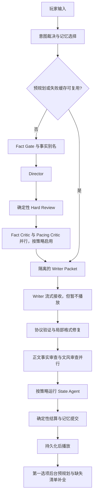

# Agent 系统流程与性能评估

检查日期：2026-09-13。基线：`farewell-web`，HEAD `2e49f28`。

本次检查游戏内运行时 agent，包括编排、记忆、API、恢复和状态提交；没有评估 Codex 自身配置或旧部署副本。检查方式为代码追踪、本地测试、三个离线复现探针和构建。不调用真实模型，因此不提供虚构的线上延迟、吞吐或费用数据。未修改产品代码。

## 结论

权限划分和确定性结算已有较好的基础，两个审查阶段也已并行。主要短板是预规划与正式回合上下文不等价、取消语义不完整、token 预算没有在当前 agent 路径强制执行，以及性能日志缺少完整回合。继续增加 agent 或并行度不是当前首要工作。

## 实际流程

- Director 失败修复已有次数上限，并保留被拒计划；正文和协议修复也保留原稿及问题残留，避免每次从零生成。
- standard 按计划内容、轮回阶段和行动风险启用审查。strict 强制启用语义、节奏、正文和状态审查。两者启用文风检查，但无历史正文时文风检查不调用模型。
- Writer 的 `<vars>` 在受控路径不进入状态；State Agent 禁止写路线、结局、轮回和事实集合；最终事务统一结算资源、时间及结局条件。
- 当前类型和设置界面只提供 standard/strict，旧 legacy 设置被归一化。部分文档仍描述 legacy 运行路径；08:00 已落入实现，文档前段仍保留 07:30 待迁移措辞，需清理。

## 优先处理的问题

### P1：预规划没有与正式回合使用同一份上下文

正式路径传入 `playerIntentPolicy`、`requiresStateAgent`、行动场景契约和定时指令；后台路径没有等价构建这些输入。缓存键只包含模式、轮回、地点、路线、聊天 ID。输入相同且键匹配时，直接采用旧的完整 Writer 消息和 reviewPolicy。

因此，同一个第一选项若涉及幻想/调查饱和转向，后台生成的审查策略可能与正式路径不同；修改设置、记忆或其他未入键状态后，也缺乏等价性保证。此项为代码路径确认，尚未运行浏览器端场景复现。

证据：`src/hooks/useGameLoop.ts:223`、`:474`、`:488`、`:810`；`src/agents/mystery/orchestrator.ts:490`。

建议统一构建正式/预规划请求，以状态版本和完整策略输入生成缓存指纹；命中时验证版本，不能只匹配玩家文字。

### P1：取消不能可靠阻止后续处理

`consumePreplan()` 在等待 Promise 之前清空全局槽位。此后 `invalidatePreplans()` 已无法取得该请求的 AbortController，正式回合的 controller 也没有接管它。离线探针已复现：接管运行中的预规划后执行 invalidate，原 signal 仍为未取消。

此外，State Agent 的 catch 将所有错误统一降级为 `finalize(..., {})`，包括取消错误。切换会话时会取消当前请求，但这个分支没有区分取消与可降级的模型故障，存在取消后继续提交旧回合的风险；后者尚未做浏览器时序复现。

证据：`src/agents/mystery/preplan.ts:51`、`:57`、`:66`；`src/hooks/useGameLoop.ts:1209`；`src/utils/gameSession.ts:69`。

建议在接管时绑定取消信号，保留运行中请求的所有权；提交前检查回合/会话版本，取消错误直接退出。

### P1：上下文预算只被记录，没有约束当前 agent 输入

`compileTurnContext()` 按条数选最近 4 条消息、8 条 episode、40 条 cognition 和20条软事实，但不根据 maxContext 裁剪。当前 hook 把这些结果直接交给 Director/Writer；其他 prompt assembler 中的预算逻辑不能替代该路径的限制。State Agent 还直接发送完整 variables，包含持续积累的 worldMemory。

离线探针：maxContext=8192、reservedOutput=4096，输入一条 20,000 字消息后仍原样保留；estimatedSelected=23124，reservedRepair=656。这个估算还不是所有最终序列化消息的总成本。

影响：长局或大输入会增加费用、延迟及超上下文失败；结构化输出降级无法解决过长输入。

证据：`src/memory/world-memory.ts:349`、`:385`；`src/hooks/useGameLoop.ts:406`、`:465`；`src/agents/state/state-agent.ts:211`。

建议对每个角色的最终 messages 执行预算，保留硬规则和授权事实，按相关性裁剪历史；State Agent 只接收允许变更的最小状态投影。

### P2：State 证据校验只能证明引文出现过

验证器检查引文长度和原文包含关系，不验证引文是否证明字段变化，也没有在此层将普通嫌疑增长绑定到新事实 ID。

离线探针：以玩家输入“我猜老人有嫌疑”为引文，正文为“没有找到新的证据”，`suspicion.old-man=10` 仍被接受。每日增幅上限和禁止字段保护仍有效，但不能解决证据语义问题。探针直接构造 State 响应，证明验证器边界，不代表真实模型必然产生该响应。

证据：`src/agents/state/state-agent.ts:123`、`:155`。

建议对证据类数值增长采用程序授权的事实/事件 ID 并去重；玩家尝试与已发生结果分开传递。

### P2：性能和质量评估尚未覆盖生产回合

- `totalDurationMs` 在 prepareMysteryTurn 返回 Writer 消息时就结束，success 不表示正文和事务成功。
- 日志仅保留内存中的 20 条，含 speculative 请求；没有完整回合关联、Writer/State耗时、首段可播放耗时、token usage、实际HTTP调用数或预规划命中/浪费指标。
- 真实 API 脚本手工编排场景、推进轮回，未复用 hook 全链路；正文修复次数也不同，缺少完整文风、State 和持久化路径，不能替代游戏端到端验收。

证据：`src/agents/mystery/orchestrator.ts:355`、`:372`；`src/agents/mystery/orchestration-log.ts:35`；`scripts/deepseek-flash-e2e.ts:196`。

## 性能模型

以下是代码推导的逻辑模型调用次数，排除网络重试、JSON纠错、格式降级、后台预规划及清单补全；不是线上实测。

| 路径 | 无修复逻辑调用次数 |
| --- | --- |
| standard 低风险且无需正文/State复核 | 2–3：Director、Writer，有历史时文风模型审查 |
| standard 关键回合 | 按启用策略增加，最多与 strict 相同 |
| strict | 6–7：Director、两项计划审查、Writer、正文事实审查、State，以及有历史时文风模型审查 |

无缓存时，可播放延迟近似为：

`T导演 + max(T计划事实审查, T节奏审查) + T写作 + max(T正文审查, T文风审查) + T状态 + T本地提交 + T修复`

跳过的阶段按0计。并行只能减少对应两项中的较短耗时，不能消除前后依赖。Writer 收到首 token 后仍在缓冲，因此首 token 时间不等于玩家看到正文的时间。

次 API 每次尝试超时30秒，默认再试2次，退避1秒、2秒；若三次都超时，一个逻辑调用约93秒才失败。JSON纠错、协议降级和业务修复还有独立预算，因此尾延迟可能叠加；当前没有跨阶段的整回合截止时间。

预规划只猜第一选项，没有命中统计。它在命中时可隐藏导演阶段等待；未命中时增加已消耗请求，且可能与清单补全/前台请求竞争额度。是否值得默认开启，需要以实际命中率和浪费token测量决定。

## 本次验证结果

| 检查 | 结果 |
| --- | --- |
| 默认 `npm test -- --run` | 1210通过、32失败；误纳入嵌套 `.worktrees` 测试，共172文件，63.37秒 |
| 排除 `.worktrees` 后测试，含3个审计探针 | 630通过、1失败，共88文件，27.68秒 |
| Agent现有测试 | 本次运行中全部通过；不能据此推定真实模型质量达标 |
| 审计探针 | 3项通过，即上述当前限制成功复现 |
| `npm run lint` | 通过 |
| `npx tsc -b` | 通过 |
| `npm run build` | 通过；Vite阶段31.67秒 |

剩余失败：`src/ui/penpotPcUiAssets.test.ts:137`，CSS块未包含期待的 `border-color: #f2f2f0`。这是本次检查前已有的UI契约问题；本次未修复。测试总耗时受本机并行检查影响，不是游戏性能。

复现文件：`.codex-test-tmp/agent-audit-probes.test.ts`。日志：同目录 `agent-audit-*.log`。

## 下一轮评估建议

1. 先修预规划上下文、取消与预算问题，再比较性能，避免用行为不等价的路径获得表面加速。
2. 增加完整turnId链路，记录阶段起止、可播放时间、tokens、重试/修复次数、缓存命中、取消和提交结果。并行阶段不要直接相加当墙钟时间。
3. 固定回放语料：日1–3、3→4边界、锁路线和结局、调查饱和、幻想、移动/定时事件、长历史、模型错误和取消、预规划命中/未命中。
4. 同一输入和状态对比standard/strict及预规划开关，报告P50/P95可播放延迟、每成功回合token、首轮通过率、修复率、阻塞率和状态一致率。泄密、越权、错误提交单独统计，不能用平均分掩盖。
5. 真实模型输出采用人工标注的事实/节奏/能动性标准；记录模型版本和采样参数，并使用独立留出样本验证误报过滤规则。

这些是后续验收项，不是本次已经取得的线上结果。
